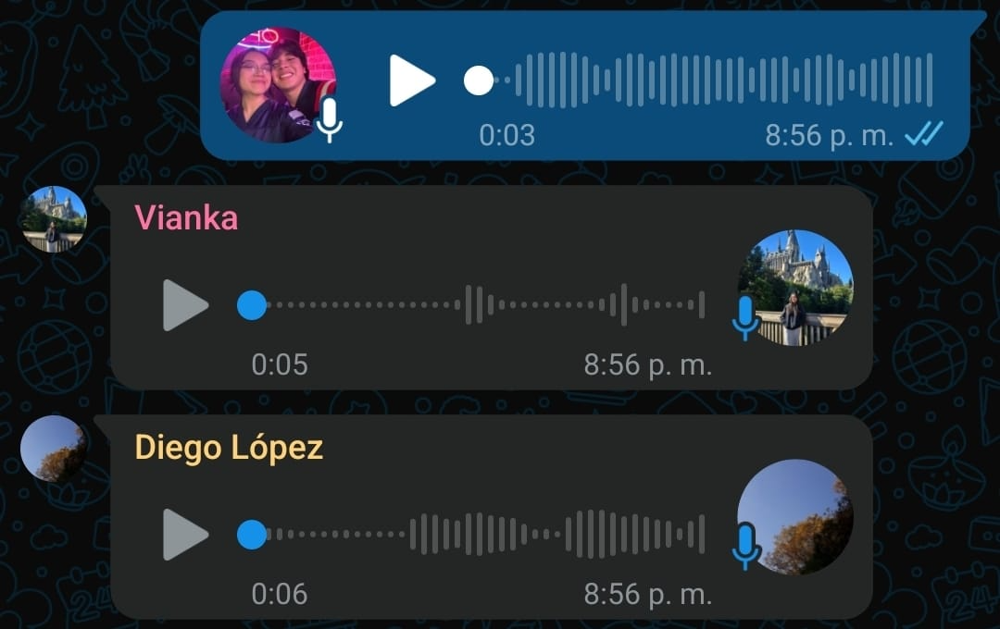
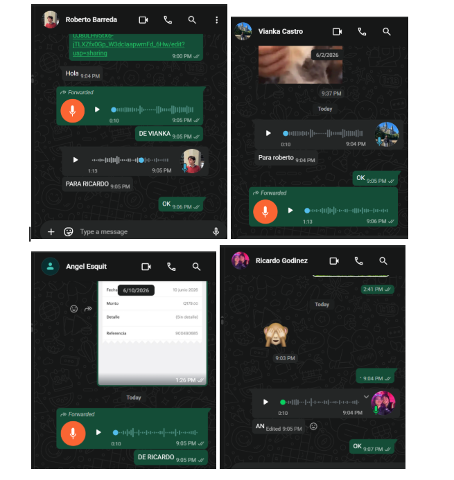

# Reporte Grupal – Laboratorio 1  
## Esquemas de comunicación y conmutación de mensajes

---

### Información general

| Campo | Información |
|---|---|
| Curso | Redes de Computadoras  |
| Laboratorio | Laboratorio 1 |
| Docente | Jorge Yass |


### Integrantes

| Rol | Nombre completo | Carnet |
|---|---|---|
| Integrante 1 | Vianka Vanessa Castro Ordoñez  | 23201 |
| Integrante 2 | Ricardo Arturo Godínez Sánchez | 23247 |
| Integrante 3 | Diego Javier Lopez Reinoso     | 23747|
---
Integrantes del otro grupo 
| Rol | Nombre completo | Carnet |
|---|---|---|
| Integrante 1 | Roberto  | 23201 |
| Integrante 2 | Angel Esquit | 23247 |
---

## 3. Desarrollo de la actividad

### 3.1 Transmisión de códigos

#### Mensajes enviados con código Morse

| No. | Emisor | Receptor | Mensaje original | Mensaje recibido | Errores encontrados |
|---:|---|---|---|---|---:|
| 1 | Vianka | Ricardo | VOY A LLORAR | VOY QA ZFQ | 7 |
| 2 | Vianka | Diego | VOY A LLORAR | SASFJK | 11 |
| 3 | Vianka | Ricardo | PROYECTO | PROUD MSAIQ | 8 |
| 4 | Vianka | Diego | PROYECTO | ASDFJVK | 8 |
| 5 | Vianka | Ricardo | VÁMONOS MIMIR | OOWIDJ AIWIS | 10 |
| 6 | Vianka | Diego | VÁMONOS MIMIR | MCURFOKS | 12 |
| 7 | Ricardo | Vianka | APAGA LA VELA | MSÑSKI SJSJDJS | 13 |
| 8 | Ricardo | Diego | APAGA LA VELA | HARNQ DBRE | 11 |
| 9 | Ricardo | Vianka | DIEGO MONITO | LOOOOS HAY | 11 |


#### Mensajes enviados con código Baudot
| No. | Emisor | Receptor | Mensaje original | Mensaje recibido | Errores encontrados |
|---:|---|---|---|---|---:|
| 1 | Ricardo | Diego | DIEGO MONITO | OISJSJ ÑAIW | 10 |
| 2 | Ricardo | Vianka | NO LE SABE LUZ | BAAKKJS LOPA | 12 |
| 3 | Ricardo | Diego | NO LE SABE LUZ | BADTA RAIS | 12 |
| 4 | Diego | Ricardo | WOOF WOOF | ASDASWW | 8 |
| 5 | Diego | Vianka | WOOF WOOF | GPPHSAAJWIJ | 11 |
| 6 | Diego | Ricardo | DÍA DEL PLÁTANO | KKKSCWO# | 15 |
| 7 | Diego | Vianka | DÍA DEL PLÁTANO | LLMSNCCSXS | 14 |
| 8 | Diego | Ricardo | HOLA HOLA UWU | WWWPMCCSX | 13 |
| 9 | Diego | Vianka | HOLA HOLA UWU | LQQSPSXAS | 12 |


### 3.2 Comparación de los esquemas

#### ¿Qué esquema fue más fácil de transmitir y por qué?

El esquema mas sencillo fue el morse ya que teniamos algo de nocion antes de el sistema

#### ¿Qué esquema fue más difícil de transmitir y por qué?

El mas complicado fue el Badout porque era nueva y no teniamos tanta guia de como sonoba cada caracter
#### ¿Qué esquema fue más fácil desde la perspectiva del receptor?

Creemos que con practica en Boudot eventaulmente se cometeran menos errores ya que es un sistema mas ordenado, pero en morse se nos hizo menos propenso a errores
#### ¿Qué esquema presentó menos errores?

Tras probar ambos modos de comunicación, observamos que con el código Morse ocurrieron menos errores, principalmente porque fue el sistema que se nos facilitó más comprender y utilizar. Su estructura nos resultó más familiar y sencilla de interpretar durante la actividad.

Por otro lado, con el código Baudot tuvimos mayores dificultades para descifrar los mensajes e incluso para identificar algunas letras, ya que era un modelo desconocido para nosotros. Además, nos pareció más complejo y rápido que el Morse, lo cual aumentó la posibilidad de cometer errores durante la comunicación.

### 3.3 Transmisión empaquetada

#### Mensajes enviados mediante notas de voz

| No. | Emisor | Receptor | Código utilizado | Mensaje original | Mensaje recibido | Dificultades |
|---:|---|---|---|---|---|---|
| 1 | Vianka | Ricardo | Baudot | Mañana hay clases | Mañana hay clases | El mensaje se entendió correctamente después de escucharlo dos veces. |
| 2 | Vianka | Diego | Baudot | Tengo mucha hambre | Tengo mucha hambre | Algunas pausas entre palabras no fueron claras. |
| 3 | Vianka | Ricardo | Baudot | Vamos por un café | Vamos por un café | Fue necesario bajar la velocidad del audio para confirmar una letra. |
| 4 | Ricardo | Vianka | Baudot | La tarea está fácil | La tarea está fácil | El audio presentó un poco de ruido, pero el mensaje fue comprendido. |
| 5 | Ricardo | Diego | Baudot | Hoy juega mi equipo | Hoy juega mi equipo | Fue necesario repetir la nota de voz para identificar los espacios. |
| 6 | Ricardo | Vianka | Baudot | Nos vemos mañana | Nos vemos mañana | No se presentaron errores importantes. |
| 7 | Diego | Ricardo | Baudot | El plátano es amarillo | El plátano es amarillo | El mensaje era largo y se tuvo que escuchar varias veces. |
| 8 | Diego | Vianka | Baudot | Quiero dormir temprano | Quiero dormir temprano | Algunas letras se confundieron al inicio, pero se corrigieron al repetir el audio. |
| 9 | Diego | Ricardo | Baudot | Vamos a terminar rápido | Vamos a terminar rápido | La velocidad de transmisión dificultó identificar una palabra. |



#### ¿Qué dificultades involucró enviar un mensaje de forma empaquetada?

Algunas dificultades que podemos encontrar en los mensajes empaquetados es que si el audio se reproduce en fomra de bucle no se sabe cuando termina, lo que puede llevar a dificultades para su codificacion.


### 3.4 Conmutación de mensajes

#### Distribución de roles

| Participante | Rol asignado | Identificador utilizado |
|---|---|---|
| [Nombre] | Cliente 1 | [C1 / nombre / número] |
| [Nombre] | Cliente 2 | [C2 / nombre / número] |
| [Nombre] | Cliente 3 | [C3 / nombre / número] |
| [Nombre] | Conmutador | [SW1 / nombre] |

#### Topología utilizada

```text
                 ┌──────────────┐
                 │   Cliente 1  │
                 └──────┬───────┘
                        │
                        ▼
┌──────────────┐   ┌──────────────┐   ┌──────────────┐
│   Cliente 2  │──▶│  Conmutador  │──▶│   Cliente 3  │
└──────────────┘   └──────────────┘   └──────────────┘
```

---

## 5. Preguntas de análisis

### ¿Qué posibilidades incluye la introducción de un conmutador en el sistema?

[Analice aspectos como la comunicación indirecta, el control del tráfico, el reenvío de mensajes, la administración de destinos, la creación de rutas y la posibilidad de conectar más usuarios.]

### ¿Qué ventajas se obtienen al agregar más conmutadores?

- [Ventaja 1]
- [Ventaja 2]
- [Ventaja 3]

### ¿Qué desventajas se presentan al agregar más conmutadores?

- [Desventaja 1]
- [Desventaja 2]
- [Desventaja 3]

### Análisis general

[Explique cómo cambia la complejidad, el tiempo de entrega, la posibilidad de fallos, la escalabilidad y la administración de la red al agregar más conmutadores.]

---

## 6. Evidencias de la actividad de conmutación



**Descripción:** [Indique qué se observa.]


**Descripción:** [Indique qué se observa.]


**Descripción:** [Indique qué se observa.]

---

## 7. Discusión grupal

[Describa la experiencia del grupo durante la actividad. Incluya los principales problemas encontrados, las diferencias entre la comunicación directa y la comunicación mediante un conmutador, y los aprendizajes obtenidos.]

---

## 8. Conclusiones

1. [Conclusión relacionada con los códigos Morse y Baudot.]
2. [Conclusión relacionada con los errores de transmisión.]
3. [Conclusión relacionada con los mensajes empaquetados.]
4. [Conclusión relacionada con el funcionamiento del conmutador.]
5. [Conclusión general del laboratorio.]

---