# Laboratorio 1 — Introducción a Wireshark

**Nombre:** Ricardo Godinez
**Carné:** 23247
**Curso:** Redes de computadoras
**Fecha:** 12/07/2026
**Entorno:** Arch Linux

---

## 1. Personalización del entorno

### 1.1 Creación del perfil

Perfil creado: **`Ricardo_Godinez`** (`Edit → Configuration Profiles → +`).

Ubicación en disco:

```bash
ls ~/.config/wireshark/profiles/
```

> **Evidencia — perfil activo**
>
> 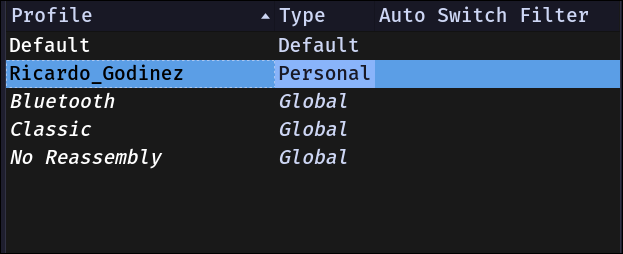
> *Fig. 1 — Perfil `Ricardo_Godinez` activo.*

---

### 1.2 Apertura del archivo de traza

Archivo analizado: `intro-wireshark-trace1.pcap`

> **Evidencia — archivo abierto**
>
> 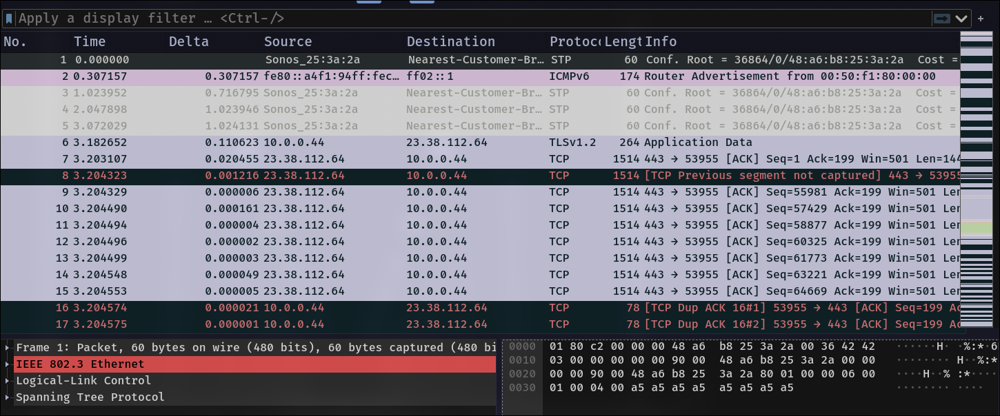
> *Fig. 2 — `intro-wireshark-trace1.pcap` cargado en Wireshark.*

---

### 1.3 Formato de tiempo: Time of Day

`View → Time Display Format → Time of Day`

Diferencia respecto al formato por defecto (*Seconds Since Beginning of Capture*):

> **Evidencia del cambio hecho**
> 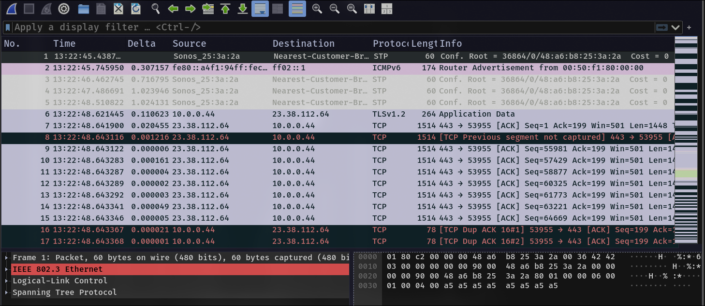
> *Fig. 3 —  cambio del formato en Wireshark.*

---

### 1.4 Columna adicional: longitud del protocolo

`Edit → Preferences → Columns → +`

| Campo | Valor usado |
|---|---|
| Title | [ `Proto Length`] |
| Type | [. Custom] |
| Fields |[ `tcp.len`] |

> **Evidencia del cambio hecho**
> 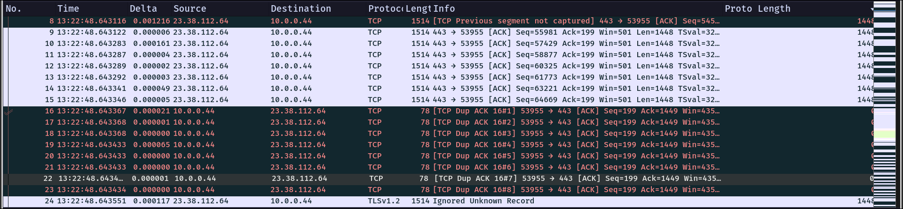
> *Fig. 4 —  Creacion de la nueva columna.*

---

### 1.5 Eliminar / ocultar la columna Length

> **Evidencia del cambio hecho**
> 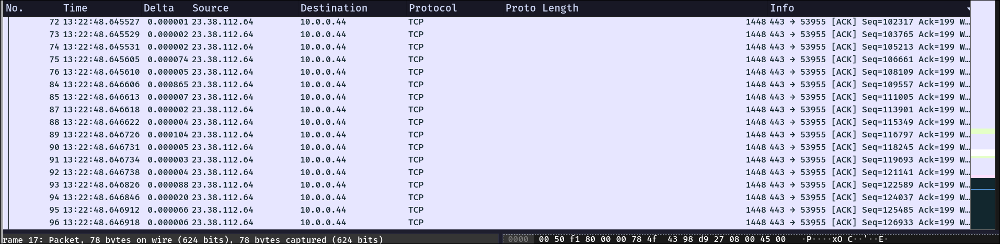
> *Fig. 5 —  Ocultar columna de longitud.*
---

### 1.6 Esquema de paneles (Layout) personalizado

> **Evidencia del cambio hecho**
> 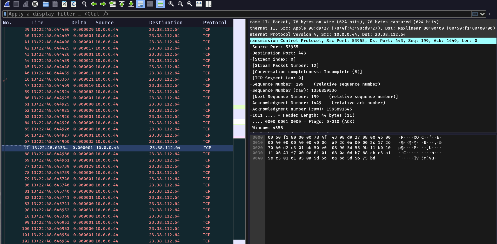
> *Fig. 6 —  Cambio de layout.*

---

### 1.7 Regla de color: TCP con bandera SYN = 1


> **Evidencia — regla de color aplicada**
>
> 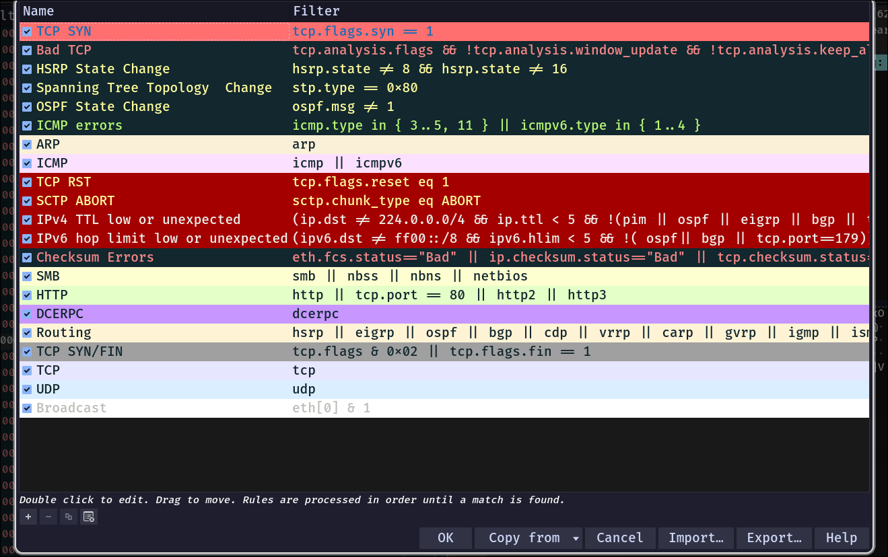
> *Fig. 7 — Configuración de la regla de color.*
>
> 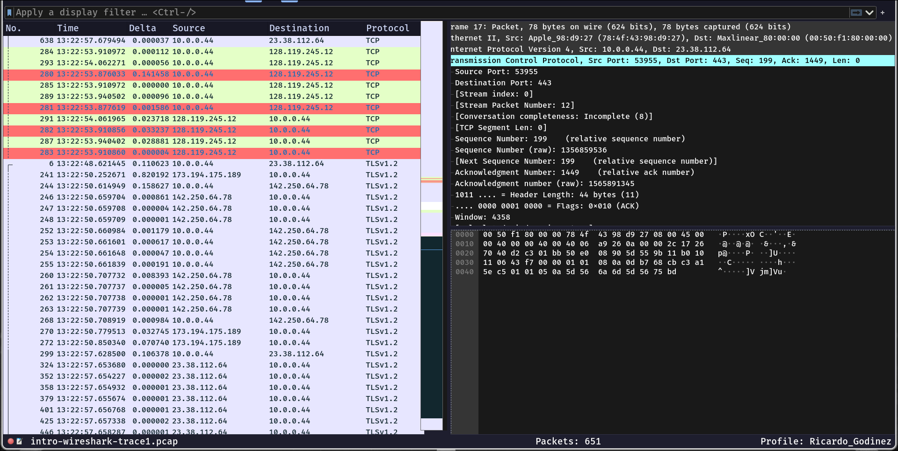
> *Fig. 8 — Paquetes TCP SYN resaltados con el color definido.*

---

### 1.8 Botón de filtro (Filter Button)

> **Evidencia — botón funcionando**
>
> 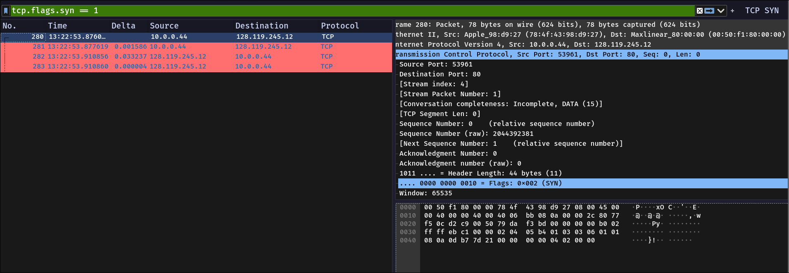
> *Fig. 9 — Botón creado y filtro aplicado sobre la traza.*

---

### 1.9 Ocultar interfaces virtuales


> **Evidencia — lista simplificada de interfaces**
> 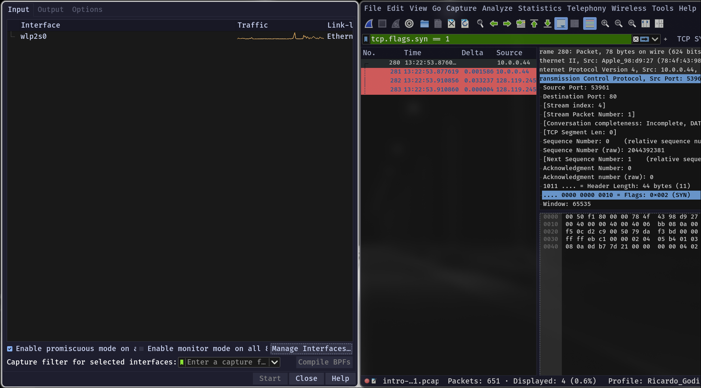
> *Fig. 10 — Lista de interfaces de captura tras ocultar las virtuales.*

---

### 1.10 Entorno final personalizado

> **Evidencia — vista global**
>
> 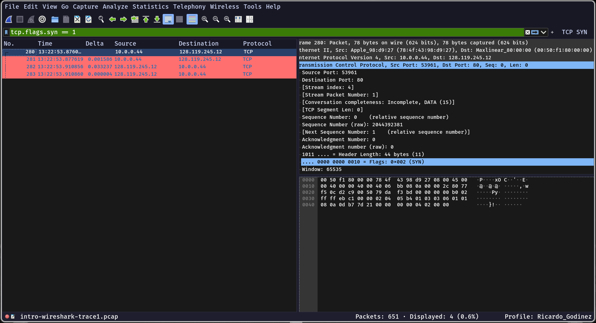
> *Fig. 11 — Entorno completo: perfil, layout, columnas, regla de color y botón de filtro.*

---

## 2. Configuración de la captura de paquetes (ring buffer)

### 2.1 Salida de `ip`/`ifconfig`

**Salida obtenida:**

> 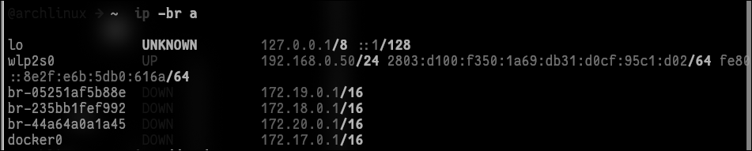
> *Fig. 12 — Salida obtenida.*

**Explicación de lo observado:**

El sistema reporta **6 interfaces**, número que coincide exactamente con el indicador "6 interface(s)" que Wireshark mostraba en su pantalla de bienvenida antes de aplicar el filtrado. De estas, **solo una es física**.
 
| # | Interfaz | Tipo | Estado | Dirección(es) | MTU | Descripción |
|---|---|---|---|---|---|---|
| 1 | `lo` | Virtual (kernel) | `UNKNOWN` | `127.0.0.1/8`, `::1/128` | 65536 | Loopback. Tráfico interno del host; nunca sale a la red. |
| 2 | `wlp2s0` | **Física (WiFi)** | **`UP`** | `192.168.0.50/24`, IPv6 global y link-local | 1500 | Única interfaz con conectividad real. MAC `14:5a:fc:2d:83:8f`. |
| 3 | `br-05251af5b88e` | Virtual (bridge) | `DOWN` | `172.19.0.1/16` | 1500 | Bridge de red custom de Docker Compose. |
| 4 | `br-235bb1fef992` | Virtual (bridge) | `DOWN` | `172.18.0.1/16` | 1500 | Bridge de red custom de Docker Compose. |
| 5 | `br-44a64a0a1a45` | Virtual (bridge) | `DOWN` | `172.20.0.1/16` | 1500 | Bridge de red custom de Docker Compose. |
| 6 | `docker0` | Virtual (bridge) | `DOWN` | `172.17.0.1/16` | 1500 | Bridge por defecto de Docker. |

---

### 2.2 Desactivación de interfaces virtuales


> **Evidencia**
>
> 
> *Fig. 9 — Solo la interfaz [WiFi/Ethernet] queda habilitada.*

---

### 2.3 Configuración del ring buffer

> 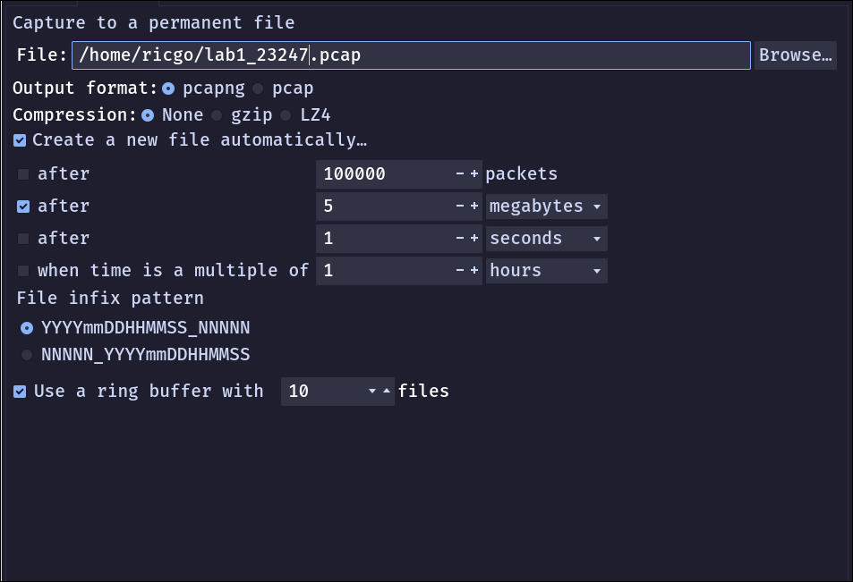
> *Fig. 13 — Pestaña Output con la configuración de ring buffer.*

---

### 2.4 Generación de tráfico y archivos creados

**Tráfico generado mediante:** `ping` en modo *flood* con paquetes de tamaño ampliado, dirigido al resolver público de Google:
 
```bash
sudo ping -f -s 1400 8.8.8.8
```
> **Evidencia — archivos del ring buffer**
>
> 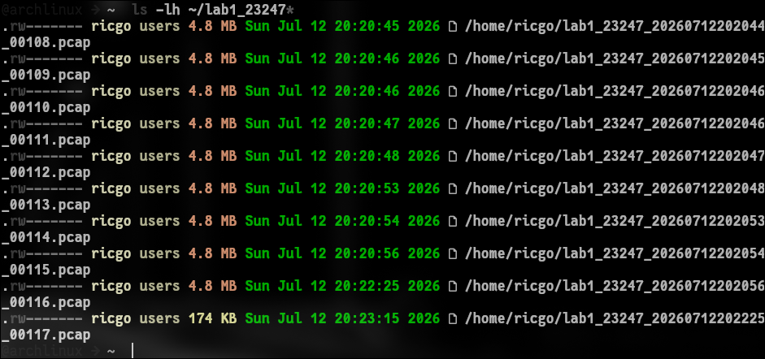
> *Fig. 11 — Archivos `lab1_[carné]_0000N_*.pcap` creados por el ring buffer.*

**Archivos adjuntos a la entrega:**

Ver los archivos en [`files/`](files/)

---

## 3. Análisis de paquetes — Protocolo HTTP

### 3.1 Procedimiento

> **Evidencia — captura HTTP**
> 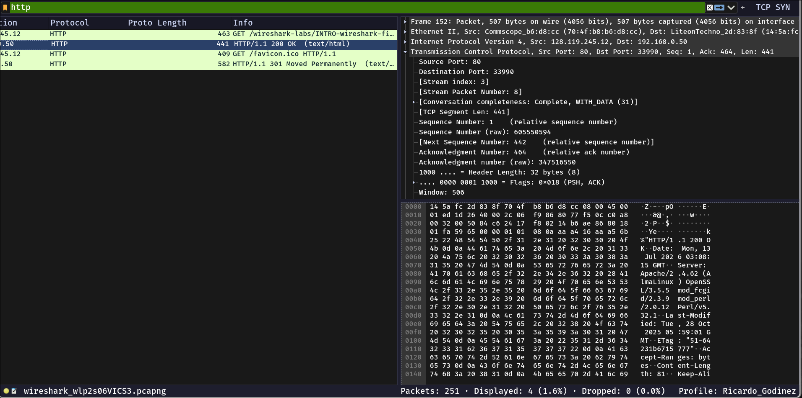
> *Fig. 15 — Paquetes HTTP filtrados. Se observan el `GET` y la respuesta `200 OK`.*

---

### 3.2 Respuestas

#### a) ¿Qué versión de HTTP está ejecutando su navegador?

**HTTP/1.1**
 
La versión se declara al final de la línea de solicitud del paquete 134:
 
```
GET /wireshark-labs/INTRO-wireshark-file1.html HTTP/1.1
Host: gaia.cs.umass.edu
Connection: keep-alive
Upgrade-Insecure-Requests: 1
User-Agent: Mozilla/5.0 (X11; Linux x86_64) AppleWebKit/537.36 (KHTML, like Gecko) Chrome/150.0.0 Safari/537.36
```
 
De paso, el User-Agent delata bastante: navegador basado en Chromium corriendo sobre Linux x86_64.

---

#### b) ¿Qué versión de HTTP está ejecutando el servidor?

**HTTP/1.1**
 
La versión aparece al inicio de la línea de estado del paquete 152:
 
```
HTTP/1.1 200 OK
Date: Mon, 13 Jul 2026 03:08:15 GMT
Server: Apache/2.4.62 (AlmaLinux) OpenSSL/3.5.5 mod_fcgid/2.3.9 mod_perl/2.0.12 Perl/v5.32.1
Last-Modified: Tue, 28 Oct 2025 05:59:01 GMT
ETag: "51-64231b6715777"
Accept-Ranges: bytes
Content-Length: 81
Content-Type: text/html
```
 
Cliente y servidor coinciden en HTTP/1.1, así que la conversación fluye sin problema.
---

#### c) ¿Qué lenguajes indica el navegador que acepta al servidor?

**Inglés — concretamente `en-US,en;q=0.9`**
 
Esto sale del encabezado `Accept-Language` que el navegador manda dentro del `GET` (paquete 134). Ahí le está diciendo al servidor en qué idiomas prefiere recibir la página, y en qué orden:

> 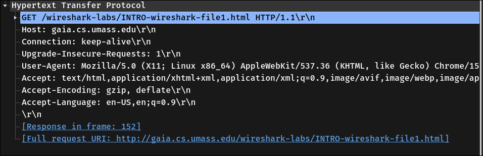
> *Fig. 16 — Header `Accept-Language`.*

---

#### d) ¿Cuántos bytes de contenido fueron devueltos por el servidor?

**Respuesta:** `81 bytes`

> 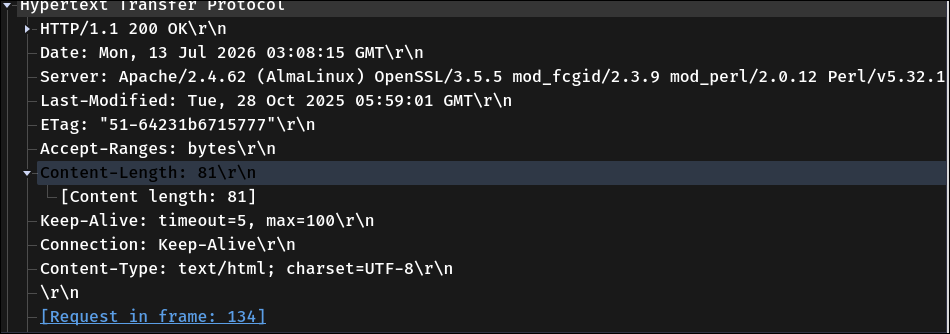
> *Fig. 17 — Bytes de contenido devueltos por el servidor.*

---

#### e) Ante un problema de rendimiento en la descarga, ¿en qué elementos de la red convendría "escuchar" los paquetes? ¿Es conveniente instalar Wireshark en el servidor? Justifique.

El asunto es que un cuello de botella puede estar en cualquier punto del camino entre el cliente y el servidor. Si uno captura solo en un extremo, ve los síntomas pero no sabe de dónde vienen.
 
Lo correcto es capturar en **varios puntos a la vez** y comparar. El lugar donde los síntomas aparecen por primera vez es el que delata dónde está el problema.

Podemos poner varios observadores y en orden de donde es mas conveniente ponerlos es:
-   En nuestra pc
-   En el router de salida
-   En un switch
-   En el balanceador
-   En el server

La verdad no es conveniente instalar Wireshark en el servidor, aunque pueda parecer util consume muchos recursos, si la ponemos en un servidor que sospechamos que esta lento va a estar mucho peor. 

Ademas de que wireshark es una herramienta grafica, cosa que los servidores no tienen ese entorno habitualmente. Hay herramientas mas adeciadas para este caso como tcpdump, este solo graba los paquetes en un archivo y casi no consume recursos.
---

## 4. Discusión

### 4.1 Sobre la primera parte

La primera parte me parecio bastante interactiva e interesante, talvez un poco complicada el ponernos de acuerdo para el uso del codigo morse porque era muy dificl poder verificar bien que se queria decir y si se queria saber preciso requeria mucho tiempo. Que el trabajo sea grupal me gusto pero talvez algo mas dinamico no tan pausado.

### 4.2 Sobre la personalizacion de wireshark

Me gusto que se pudiera personalizar varias cosas de esta herramienta, desde los colores, filtros, cambiar la interfaz... que hacen que la experiencia usandolo sea mas sencilla, y mas facil.

### 4.3 Sobre usar wireshark

Al principio fue dificil entender lo que estaba pasado, porque aunque despues se podia personalizar cuando se abre la herramienta la primera vez se veia confusa, y me costo un poco entender todo lo que estaba pasando.

### 4.4 Dificultades y aprendizajes

Como mencione lo que se me dificulto fue comprender todo lo que ofrecia la herramienta y que es lo que estabamos midiendo. Luego entendi que es como ver todas las partes de los paquetes destripados y ver como se comunican entre ellos.
---

## 5. Conclusiones

1. > Wireshark es una herramienta muy util para ver el trafico de la red y verla completa.

2. > El ring buffer es una herramienta muy util para ver todo el ciclo de los paquetes y poder detectar errores.

3. > Es importante los protocolos como HTTPS porque es mucho mas seguro que HTTP que nos da info de todo.

