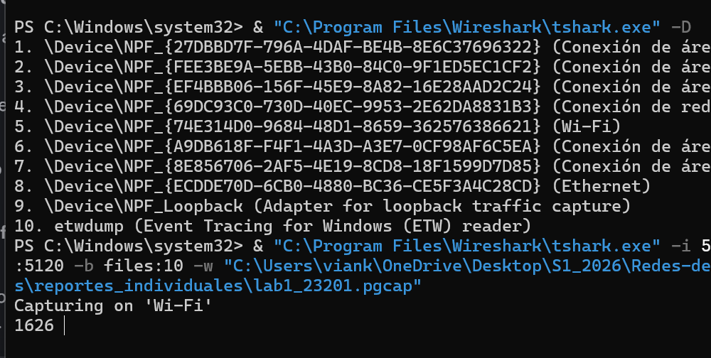
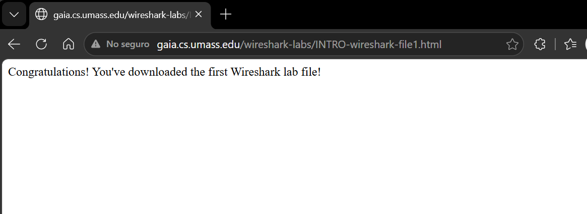
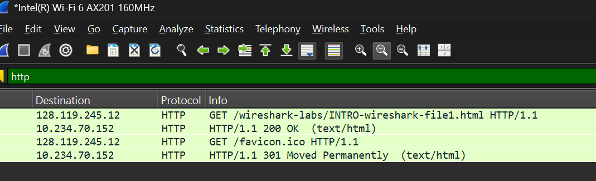
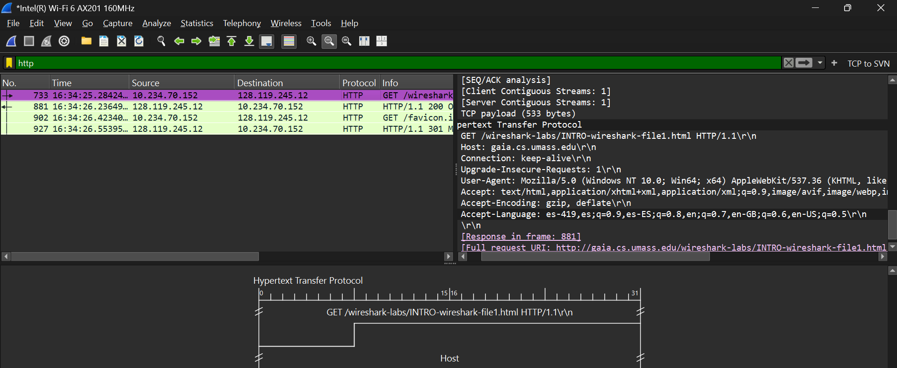
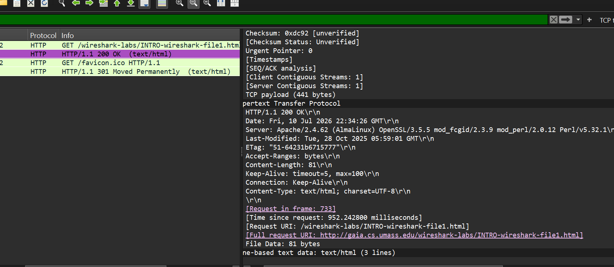
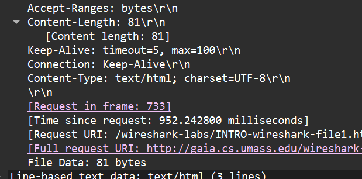

# Reporte Individual – Laboratorio 1  

## Introducción a Wireshark

---

### Información general

| Campo | Información |
|---|---|
| Nombre  | Vianka Castro|
| Carnet | 23201|
| Curso | Redes de Computadoras |
| Laboratorio | Laboratorio 1 |


## 4. Personalización del entorno de Wireshark

### 4.1 Creación del perfil


---

### 4.2 Apertura del archivo de captura

**Archivo utilizado:** `intro-wireshark-trace1.pcap`


---

### 4.3 Formato de tiempo

**Formato seleccionado:** `Time of Day`

**Ruta utilizada:** `View > Time Display Format > Time of Day`


---

### 4.4 Columna de longitud del protocolo


---

### 4.5 Diseño de paneles


---

### 4.6 Regla de color para paquetes TCP SYN

**Filtro utilizado:**

```wireshark
tcp.flags.syn == 1
```

**Color seleccionado:** [Morado]


---

### 4.7 Botón de filtro TCP SYN

**Nombre del botón:** [Nombre]

**Expresión utilizada:**

```wireshark
tcp.flags.syn == 1
```


---

### 4.8 Interfaces de captura


---

## 5. Configuración de la captura de paquetes

### 5.1 Resultado de `ipconfig` o `ifconfig`

**Comando utilizado:**

```bash
[ipconfig / ifconfig / ip addr]
```

**Resultado relevante:**

```text
Adaptador de LAN inalámbrica Wi-Fi:

   Sufijo DNS específico para la conexión. . :
   Dirección IPv6 . . . . . . . . . . : fd79:a21c:d295:b0cc:XXXX:XXXX:XXXX:XXXX
   Dirección IPv6 temporal. . . . . . : fd79:a21c:d295:b0cc:XXXX:XXXX:XXXX:XXXX
   Vínculo: dirección IPv6 local. . . : fe80::7cb7:dcab:a836:6a75%8
   Dirección IPv4. . . . . . . . . . . . . . : 192.168.31.234
   Máscara de subred . . . . . . . . . . . . : 255.255.255.0
   Puerta de enlace predeterminada . . . . . : 192.168.31.1
```

### Explicación de lo observado

| Dato | Valor observado | Explicación |
|---|---|---|
| Dirección IPv4 | 192.168.31.234 | Dirección IP privada exclusiva que el router de mi hogar asigna dinámicamente a la computadora dentro de la red local. |
| Máscara de subred | 255.255.255.0 | Prefijo de red de 24 bits (clase C) que determina que los primeros tres octetos identifican la red local y el último identifica al host. |
| Puerta de enlace | 192.168.31.1 | Dirección IP local del router que actúa como el nodo o pasarela de salida para dirigir todo el tráfico hacia el internet exterior. |
| Dirección MAC | Omitida por el sistema (`ipconfig` simple) | Dirección física de hardware de la tarjeta de red; el comando básico `ipconfig` no la despliega a menos que se use el parámetro `/all`. |
| Interfaz activa | Adaptador de LAN inalámbrica Wi-Fi | Interfaz de red por radiofrecuencia (física) que se encuentra conectada al punto de acceso y que procesa el tráfico de datos del laboratorio. |


---

### 5.2 Configuración del ring buffer

| Parámetro | Configuración |
|---|---|
| Interfaz | [WiFi/Ethernet] |
| Tamaño máximo por archivo | 5 MB |
| Número máximo de archivos | 10 |
| Nombre base | `lab1_[Carnet integrante 1].pcap` |
| Método utilizado | [Interfaz gráfica / línea de comandos] |

#### Configuración mediante interfaz gráfica




```bash
 & "C:\Program Files\Wireshark\tshark.exe" -i 5 -b filesize:5120 -b files:10 -w "C:\Users\viank\OneDrive\Desktop\
 ```
---

## 6. Análisis de paquetes HTTP

### 6.1 Procedimiento

1. Se inició una captura sin filtros.
2. Se abrió el navegador.
3. Se accedió a la dirección indicada en la guía.
4. Se detuvo la captura.
5. Se aplicó el filtro HTTP.
6. Se identificaron las solicitudes y respuestas relevantes.

**Filtro utilizado:**

```wireshark
http
```





---

### 6.2 Solicitud HTTP del navegador

**Paquete número:** [Número]


#### a. ¿Qué versión de HTTP está ejecutando el navegador?

**Respuesta:**
 HTTP/1.1

**Evidencia y explicación:**  
En la línea morada seleccionada dice: GET /wireshark-labs/INTRO-wireshark-file1.html HTTP/1.1\r\n

Fue detectado en el encabezado de la peticiónde cliente GET 

---

#### c. ¿Qué lenguajes indica el navegador que acepta?

**Respuesta:**
Por lo que veo tiene varias 
- Español Lationamericano
- Español Estándar
- Español de España
- Inglés 

**Campo analizado:** `Accept-Language`



Esto lo que hace es indicar preferencia por español según la configuración local de las variables del navegador 

---

### 6.3 Respuesta HTTP del servidor

**Paquete número:** 881



#### b. ¿Qué versión de HTTP está ejecutando el servidor?

**Respuesta:** 
HTTP/1.1 

Fue encontrada en el estado de la respuesta del servidor 200 OK 

---

#### d. ¿Cuántos bytes de contenido fueron devueltos por el servidor?

**Respuesta:** 81 bytes

**Campo analizado:** `Content-Length`



### Diferencia entre Tamaño Total del Paquete y Contenido HTTP

*   **Contenido HTTP (Carga útil / Payload):** Es la información neta solicitada o devuelta por la aplicación (en la respuesta del servidor, equivale estrictamente a los 81 bytes del archivo HTML puro).
*   **Tamaño Total del Paquete (Trama / Frame):** Representa el volumen total de bits transmitidos por el medio físico. Incluye los 81 bytes del HTML más el sobrecosto (*overhead*) de todas las cabeceras de la pila de protocolos debido al encapsulamiento: la cabecera HTTP, la cabecera TCP (capa 4), la cabecera IP (capa 3) y la cabecera de la trama Wi-Fi/Ethernet (capa 2).


---

### 6.4 Análisis de un problema de rendimiento

#### e. Si existiera un problema de rendimiento durante la descarga, ¿en qué elementos de la red convendría escuchar los paquetes?

Se debería de escuchar en tres lugares clave: 
- Host del cliente (navegador) para ver la solicitud y la respuesta.
- gateway/router local 
- interfaz de red del propio server 

Estos tres puntos nos permiten deducir si el retraso ocurre en mi propia red, durante el viaje por los routers o en el procesamiento interno del server. 

#### ¿Es conveniente instalar Wireshark directamente en el servidor?

**Respuesta:** NO

No creo que sea conveniente ya que podría afectar el rendimiento del servidor y representaría un riesgo de seguridad. 
Wireshark consume mucha memoria y CPU para dichos análisis y reconstrucción de paquetes. Si se coloca ahí puede emeporar el rendimiento o causar caída del server. 

Una opción mejor sería usar una herramienta nativa como linux o tshark. 

---

## 8. Discusión de la actividad

### 8.1 Experiencia en la primera parte

Fue un poco frustante la primera parte en equipo ya que estábamos muy desenfocados en lo que realmente se quería alcanzar en la práctica. Unos iban muy rapido en sus mensajes y no lograba alcanzar analizar o alcanzar un mensaje completamente correcto. Al final me pareció una bonita actividad mas sin embargo nos hizo falta una mejor implementación y organización. 

### 8.2 Experiencia con Wireshark

Con la segunda parte me perdía en algunas secciones, me hubiera gustado tener algún tipo de screenshots que me guiaran un poco mejor en los pasos a seguir pero al final logré entender la mayoría de los pasos y me pareció una herramienta muy útil para analizar el tráfico de red. Me gustaría explorar más sobre filtros y análisis de protocolos en futuras prácticas.

### 8.3 Hallazgos principales

- El sistema de colores es muy útil para identificar distintos filtros 
- El poder realizarlo por medio de comandos me parece más fácil 
- Wireshark puede considerarse un progama que utiliza muchos recursos y hay que tomarlo en cuenta en futuros proyectos. 

### 8.5 Aprendizaje obtenido

Durante este laboratorio logré comprender mejor cómo funciona la captura de paquetes y cómo se puede analizar el tráfico de red utilizando Wireshark. Aprendí más que nada las bases como el poder configurar perfiles, filtros y reglas de color, así como a interpretar los datos obtenidos de las capturas. Además, logré entender la importancia de la configuración del ring buffer y cómo afecta al rendimiento del análisis.

---

## 9. Conclusiones

Para concluir considero que Wireshark es una herramienta poderosa para el análisis de tráfico de red, y su correcta configuración y uso puede proporcionar información valiosa sobre el comportamiento de la red y los protocolos utilizados. La práctica fue muy útil para tener una mini guíabásica sobre todas sus funciones básicas y comprender la importancia de cada elemento en la captura y análisis de paquetes.

---
