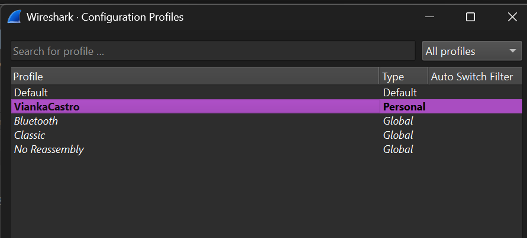
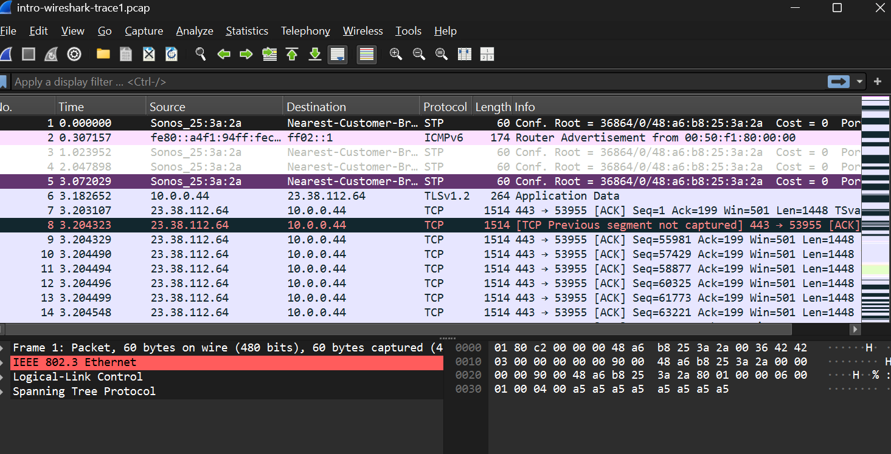
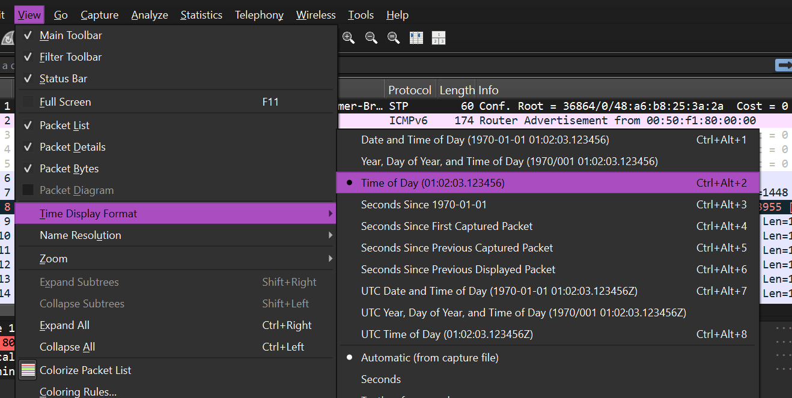
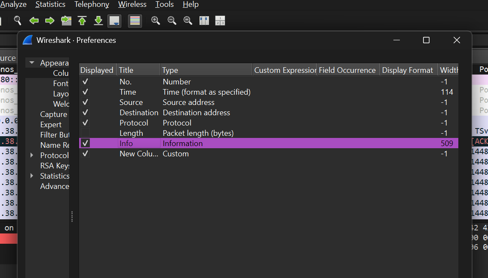
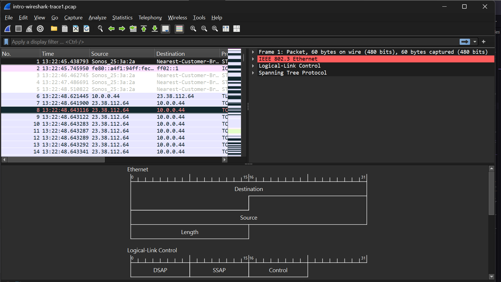
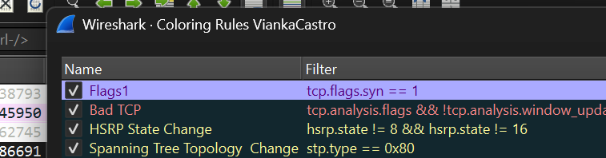
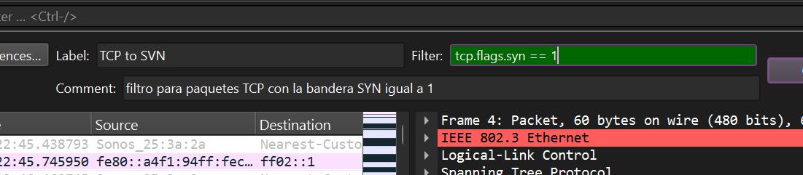
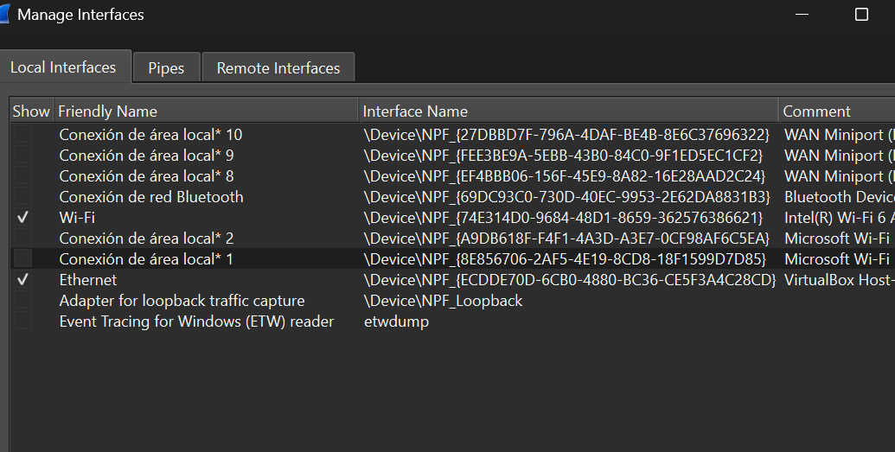
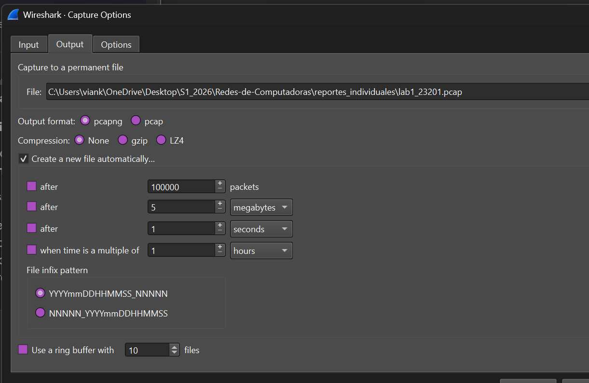

# Reporte Individual – Laboratorio 1  
## Introducción a Wireshark

---

### Información general

| Campo | Información |
|---|---|
| Nombre completo | Vianka Castro|
| Carnet | 23201|
| Curso | Redes de Computadoras |
| Laboratorio | Laboratorio 1 |


## 4. Personalización del entorno de Wireshark

### 4.1 Creación del perfil



---

### 4.2 Apertura del archivo de captura

**Archivo utilizado:** `intro-wireshark-trace1.pcap`




---

### 4.3 Formato de tiempo

**Formato seleccionado:** `Time of Day`

**Ruta utilizada:** `View > Time Display Format > Time of Day`



---

### 4.4 Columna de longitud del protocolo



---

### 4.5 Diseño de paneles



---

### 4.6 Regla de color para paquetes TCP SYN

**Filtro utilizado:**

```wireshark
tcp.flags.syn == 1
```

**Color seleccionado:** [Morado]





---

### 4.7 Botón de filtro TCP SYN

**Nombre del botón:** [Nombre]

**Expresión utilizada:**

```wireshark
tcp.flags.syn == 1
```



---

### 4.8 Interfaces de captura



---

## 5. Configuración de la captura de paquetes

### 5.1 Resultado de `ipconfig` o `ifconfig`

**Comando utilizado:**

```bash
[ipconfig / ifconfig / ip addr]
```

**Resultado relevante:**

```text
Adaptador de LAN inalámbrica Wi-Fi:

   Sufijo DNS específico para la conexión. . :
   Dirección IPv6 . . . . . . . . . . : fd79:a21c:d295:b0cc:XXXX:XXXX:XXXX:XXXX
   Dirección IPv6 temporal. . . . . . : fd79:a21c:d295:b0cc:XXXX:XXXX:XXXX:XXXX
   Vínculo: dirección IPv6 local. . . : fe80::7cb7:dcab:a836:6a75%8
   Dirección IPv4. . . . . . . . . . . . . . : 192.168.31.234
   Máscara de subred . . . . . . . . . . . . : 255.255.255.0
   Puerta de enlace predeterminada . . . . . : 192.168.31.1
```

### Explicación de lo observado

| Dato | Valor observado | Explicación |
|---|---|---|
| Dirección IPv4 | 192.168.31.234 | Dirección IP privada exclusiva que el router de mi hogar asigna dinámicamente a la computadora dentro de la red local. |
| Máscara de subred | 255.255.255.0 | Prefijo de red de 24 bits (clase C) que determina que los primeros tres octetos identifican la red local y el último identifica al host. |
| Puerta de enlace | 192.168.31.1 | Dirección IP local del router que actúa como el nodo o pasarela de salida para dirigir todo el tráfico hacia el internet exterior. |
| Dirección MAC | Omitida por el sistema (`ipconfig` simple) | Dirección física de hardware de la tarjeta de red; el comando básico `ipconfig` no la despliega a menos que se use el parámetro `/all`. |
| Interfaz activa | Adaptador de LAN inalámbrica Wi-Fi | Interfaz de red por radiofrecuencia (física) que se encuentra conectada al punto de acceso y que procesa el tráfico de datos del laboratorio. |


---

### 5.2 Configuración del ring buffer

| Parámetro | Configuración |
|---|---|
| Interfaz | [WiFi/Ethernet] |
| Tamaño máximo por archivo | 5 MB |
| Número máximo de archivos | 10 |
| Nombre base | `lab1_[Carnet integrante 1].pcap` |
| Método utilizado | [Interfaz gráfica / línea de comandos] |

#### Configuración mediante interfaz gráfica





---

## 6. Análisis de paquetes HTTP

### 6.1 Procedimiento

1. Se inició una captura sin filtros.
2. Se abrió el navegador.
3. Se accedió a la dirección indicada en la guía.
4. Se detuvo la captura.
5. Se aplicó el filtro HTTP.
6. Se identificaron las solicitudes y respuestas relevantes.

**Filtro utilizado:**

```wireshark
http
```


---

### 6.2 Solicitud HTTP del navegador

**Paquete número:** [Número]


#### a. ¿Qué versión de HTTP está ejecutando el navegador?

**Respuesta:** [HTTP/1.0, HTTP/1.1, HTTP/2 u otra]

**Evidencia y explicación:**  
[Indique el campo o línea del paquete donde encontró la versión.]

---

#### c. ¿Qué lenguajes indica el navegador que acepta?

**Respuesta:** [Ejemplo: es-ES, es, en-US, en]

**Campo analizado:** `Accept-Language`


**Explicación:**  
[Explique qué significan los valores observados.]

---

### 6.3 Respuesta HTTP del servidor

**Paquete número:** [Número]


#### b. ¿Qué versión de HTTP está ejecutando el servidor?

**Respuesta:** [Versión]

**Evidencia y explicación:**  
[Indique la línea de estado observada.]

---

#### d. ¿Cuántos bytes de contenido fueron devueltos por el servidor?

**Respuesta:** [Cantidad] bytes

**Campo analizado:** `Content-Length`


**Explicación:**  
[Explique la diferencia, si aplica, entre el tamaño total del paquete y el contenido HTTP.]

---

### 6.4 Análisis de un problema de rendimiento

#### e. Si existiera un problema de rendimiento durante la descarga, ¿en qué elementos de la red convendría escuchar los paquetes?

[Analice, como mínimo, los siguientes puntos:]

- Equipo cliente.
- Puerta de enlace o router local.
- Enlace entre redes.
- Firewall o proxy.
- Balanceador de carga, si existe.
- Servidor de destino.
- Puntos antes y después del elemento sospechoso.

#### ¿Es conveniente instalar Wireshark directamente en el servidor?

**Respuesta:** [Sí / No / Depende]

**Justificación:**  
[Explique los beneficios y riesgos. Puede mencionar consumo de recursos, permisos, seguridad, volumen de tráfico y alternativas como capturas remotas, port mirroring o TAP de red.]

---

## 7. Resumen de respuestas

| Pregunta | Respuesta |
|---|---|
| Versión HTTP del navegador | [Respuesta] |
| Versión HTTP del servidor | [Respuesta] |
| Lenguajes aceptados | [Respuesta] |
| Bytes devueltos | [Respuesta] |
| Mejor punto de captura | [Respuesta resumida] |
| ¿Instalar Wireshark en el servidor? | [Respuesta resumida] |

---

## 8. Discusión de la actividad

### 8.1 Experiencia en la primera parte

[Comente su experiencia con los códigos Morse y Baudot, la transmisión empaquetada y la conmutación de mensajes.]

### 8.2 Experiencia con Wireshark

[Describa qué partes fueron fáciles, cuáles fueron difíciles y qué funciones de Wireshark le parecieron más útiles.]

### 8.3 Hallazgos principales

- [Hallazgo 1]
- [Hallazgo 2]
- [Hallazgo 3]
- [Hallazgo 4]

### 8.4 Problemas encontrados y solución aplicada

| Problema | Posible causa | Solución aplicada | Resultado |
|---|---|---|---|
| [Problema] | [Causa] | [Solución] | [Resultado] |
| [Problema] | [Causa] | [Solución] | [Resultado] |

### 8.5 Aprendizaje obtenido

[Explique qué aprendió sobre paquetes, protocolos, interfaces, filtros, capturas y análisis de tráfico.]

---

## 9. Conclusiones

1. [Conclusión sobre la personalización y uso de Wireshark.]
2. [Conclusión sobre las interfaces y la configuración de captura.]
3. [Conclusión sobre el ring buffer.]
4. [Conclusión sobre el protocolo HTTP.]
5. [Conclusión general del laboratorio.]

---

## 10. Referencias


---